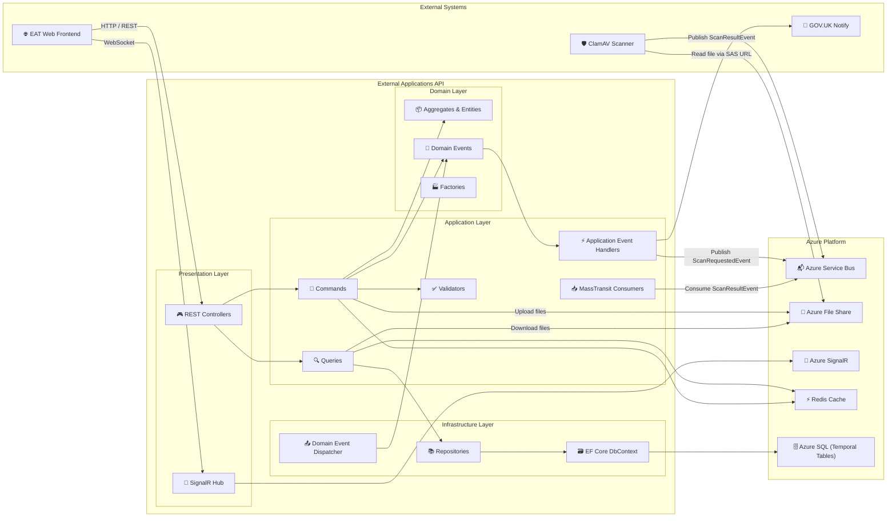
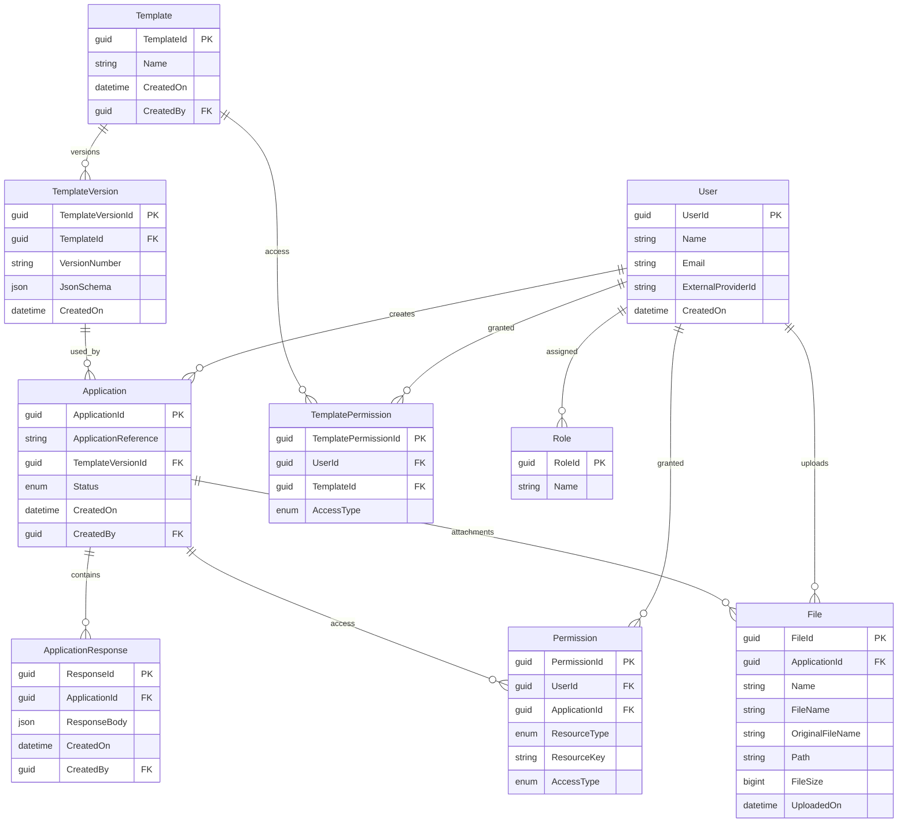
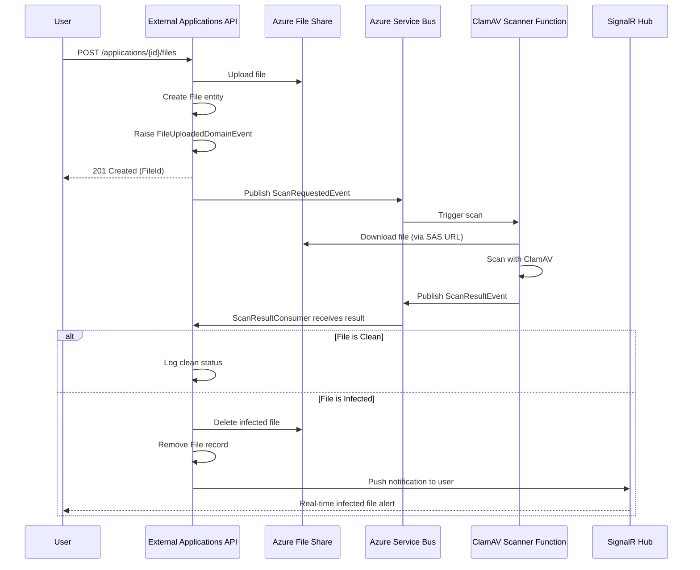
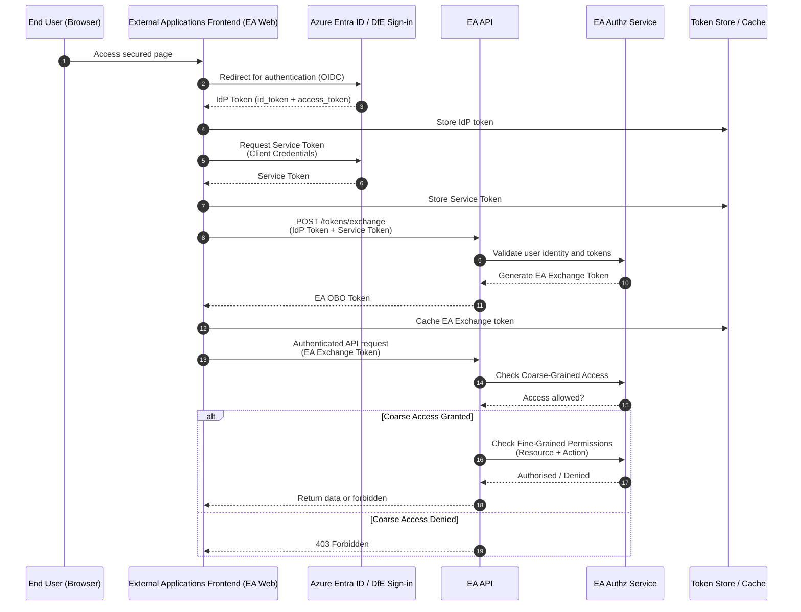

# 📋 DfE External Applications API

The **External Applications API** is the backend service for the **External Applications Tool (EAT)** — a template-driven form engine that transforms JSON schemas into dynamic, multi-step web forms for Government services.

This API manages templates, applications, user permissions, file uploads, and real-time notifications. It serves as the data and business logic layer for the EAT Web frontend, enabling rapid deployment of new government application forms without code changes.

---

## 🚀 Features

- 📝 **JSON Template Engine** — Configurable form schemas stored in versioned templates  
- 📨 **Event-Driven Architecture** — Azure Service Bus + MassTransit messaging  
- 🔐 **Multi-tenant Permissions** — Fine-grained access control per template and application  
- 📂 **Secure File Uploads** — Azure File Share storage with automatic virus scanning via ClamAV  
- 🔔 **Real-time Notifications** — SignalR integration for instant user feedback  
- ✉️ **GOV.UK Notify** — Email notifications for application events  
- 📊 **Full Audit Trail** — SQL Server temporal tables for complete change history  
- ⚡ **Rate Limiting** — Built-in throttling for API protection  
- 🧠 **Redis Caching** — Performance optimization via distributed cache  
- 🧩 **Auto-generated Client SDK** — NSwag-generated strongly-typed .NET client  

---

## 🏗️ Architecture Overview

This project follows a strict **Domain-Driven Design (DDD)** and **Clean Architecture** pattern, ensuring clear separation of concerns and maintainability.

| Layer | Project | Purpose |
|-------|---------|---------|
| **Presentation** | `DfE.ExternalApplications.Api` | REST API, SignalR hubs, authentication, Swagger |
| **Application** | `DfE.ExternalApplications.Application` | CQRS handlers, validators, domain event handlers |
| **Domain** | `DfE.ExternalApplications.Domain` | Entities, value objects, domain events, interfaces |
| **Infrastructure** | `DfE.ExternalApplications.Infrastructure` | EF Core, repositories, external service implementations |
| **Utilities** | `DfE.ExternalApplications.Utils` | Cross-cutting utilities (file hashing, etc.) |
| **Client SDK** | `GovUK.Dfe.ExternalApplications.Api.Client` | Auto-generated API client for consumers |

---

## 🔄 System Design Diagram

The following diagram illustrates the complete system architecture, showing how the EAT Web Frontend interacts with the API, and how data flows through the Clean Architecture layers to Azure platform services.



#### Layer Responsibilities

| Layer | Components | Responsibility |
|-------|------------|----------------|
| **External Systems** | EAT Web, GOV.UK Notify, ClamAV | Frontend UI, email delivery, virus scanning |
| **Azure Platform** | Service Bus, File Share, SignalR, Redis, SQL | Messaging, storage, real-time comms, caching, persistence |
| **Presentation** | Controllers, SignalR Hub | HTTP endpoints, WebSocket connections, request/response handling |
| **Application** | Commands, Queries, Validators, Event Handlers, Consumers | Business logic orchestration, validation, event processing |
| **Domain** | Entities, Domain Events, Factories | Core business rules, aggregate roots, domain event raising |
| **Infrastructure** | DbContext, Repositories, Event Dispatcher | Data persistence, external service integration, event dispatch |

#### Key Data Flows

1. **Request Flow**: Web → Controllers → Commands/Queries → Validators → Domain → Repositories → SQL
2. **Event Flow**: Domain Events → Application Event Handlers → GOV.UK Notify / Service Bus
3. **File Flow**: Commands → Azure File Share ↔ ClamAV Scanner (via SAS URLs)
4. **Real-time Flow**: SignalR Hub → Azure SignalR Service → Connected clients

---

## 📚 Domain Model

The domain model represents the core business entities and their relationships. This is a DDD-aligned model where each aggregate root (User, Template, Application) encapsulates its own business rules and child entities.



#### Entity Descriptions

| Entity | Type | Description |
|--------|------|-------------|
| **User** | Aggregate Root | Represents authenticated users with roles and permissions |
| **Role** | Entity | Defines user roles (e.g., Admin, User) for coarse-grained access |
| **Template** | Aggregate Root | Form template definition containing versioned JSON schemas |
| **TemplateVersion** | Entity | Specific version of a template's JSON schema |
| **Application** | Aggregate Root | User's form submission linked to a template version |
| **ApplicationResponse** | Entity | JSON response data for an application (supports version history) |
| **File** | Entity | Uploaded file metadata linked to an application |
| **Permission** | Entity | Fine-grained access control for specific applications |
| **TemplatePermission** | Entity | Access control for which users can use which templates |

#### Key Relationships

- **User → Application**: Users create and own applications
- **Template → TemplateVersion**: Templates have multiple versions (schema evolution)
- **TemplateVersion → Application**: Applications are bound to a specific template version
- **Application → ApplicationResponse**: Applications contain multiple response versions (draft history)
- **Application → File**: Applications can have multiple file attachments
- **User/Template → Permission/TemplatePermission**: Fine-grained access control

---

## 📬 Event Flow: File Upload & Virus Scanning

This sequence diagram shows the complete lifecycle of a file upload, from initial upload through virus scanning to final result handling. The process is fully asynchronous — users receive immediate upload confirmation while scanning happens in the background.



#### Process Steps

| Phase | Steps | Description |
|-------|-------|-------------|
| **Upload** | 1-5 | User uploads file → API stores in Azure File Share → File entity created → `FileUploadedDomainEvent` raised → User receives `201 Created` |
| **Scan Request** | 6-7 | API publishes `ScanRequestedEvent` to Service Bus → ClamAV Scanner Function triggered |
| **Scanning** | 8-10 | Scanner downloads file via SAS URL → ClamAV performs virus scan → `ScanResultEvent` published |
| **Result Handling** | 11-16 | API's `ScanResultConsumer` receives result → Clean files logged, infected files deleted with real-time notification |

#### Key Design Decisions

- **Async Processing**: Users don't wait for scans; immediate response improves UX
- **SAS URLs**: Time-limited, read-only access tokens for secure file transfer
- **Event Sourcing**: All file events tracked via domain events and Service Bus
- **Real-time Alerts**: SignalR notifies users immediately if infected files detected
- **Automatic Cleanup**: Infected files are automatically deleted from both storage and database

---

## 🗂️ Project Structure

```
external-applications-api/
├── 📄 README.md
├── 📄 Dockerfile                          # Multi-stage build with EF migrations
├── 📄 DfE.ExternalApplications.Api.sln
├── 📄 Directory.Build.props               # Shared MSBuild properties
│
├── 📁 src/
│   ├── 📁 DfE.ExternalApplications.Api/           # Presentation Layer
│   │   ├── Controllers/                           # REST API endpoints
│   │   ├── Hubs/                                  # SignalR hubs
│   │   ├── Security/                              # Authorization handlers
│   │   ├── ExceptionHandlers/                     # Global exception handling
│   │   ├── Middleware/                            # Custom middleware
│   │   ├── Swagger/                               # OpenAPI configuration
│   │   └── Program.cs                             # Application entry point
│   │
│   ├── 📁 DfE.ExternalApplications.Application/   # Application Layer
│   │   ├── Applications/                          # Application aggregate handlers
│   │   │   ├── Commands/                          # Create, Update, Submit, Upload
│   │   │   ├── Queries/                           # Get, List, Download
│   │   │   ├── EventHandlers/                     # Domain event handlers
│   │   │   └── QueryObjects/                      # Reusable query specifications
│   │   ├── Templates/                             # Template management
│   │   ├── Users/                                 # User management
│   │   ├── Notifications/                         # Notification handling
│   │   ├── Consumers/                             # MassTransit consumers
│   │   ├── Common/                                # Shared behaviors & exceptions
│   │   │   ├── Behaviours/                        # MediatR pipeline behaviors
│   │   │   ├── Exceptions/                        # Custom exceptions
│   │   │   └── Models/                            # Configuration models
│   │   └── Services/                              # Application services
│   │
│   ├── 📁 DfE.ExternalApplications.Domain/        # Domain Layer
│   │   ├── Entities/                              # Aggregate roots & entities
│   │   ├── Events/                                # Domain events
│   │   ├── ValueObjects/                          # Strongly-typed IDs
│   │   ├── Factories/                             # Entity factories
│   │   ├── Interfaces/                            # Repository contracts
│   │   ├── Services/                              # Domain services
│   │   └── Common/                                # Base classes & interfaces
│   │
│   ├── 📁 DfE.ExternalApplications.Infrastructure/# Infrastructure Layer
│   │   ├── Database/                              # EF Core DbContext
│   │   │   └── Interceptors/                      # Domain event dispatcher
│   │   ├── Repositories/                          # Repository implementations
│   │   ├── Migrations/                            # EF Core migrations
│   │   ├── Services/                              # External service implementations
│   │   └── Security/                              # Auth implementations
│   │
│   ├── 📁 DfE.ExternalApplications.Utils/         # Utilities
│   │   └── File/                                  # File utilities (hashing, etc.)
│   │
│   ├── 📁 GovUK.Dfe.ExternalApplications.Api.Client/  # Client SDK
│   │   ├── Generated/                             # NSwag auto-generated client
│   │   ├── Security/                              # Auth helpers
│   │   └── Extensions/                            # DI extensions
│   │
│   ├── 📁 Benchmarks/                             # Performance benchmarks
│   │
│   └── 📁 Tests/
│       ├── DfE.ExternalApplications.Api.Tests/              # API unit tests
│       ├── DfE.ExternalApplications.Api.Tests.Integration/  # Integration tests
│       ├── DfE.ExternalApplications.Application.Tests/      # Application layer tests
│       ├── DfE.ExternalApplications.Domain.Tests/           # Domain layer tests
│       └── DfE.ExternalApplications.Tests.Common/           # Shared test utilities
│
├── 📁 terraform/                          # Infrastructure as Code
│   ├── container-apps-hosting.tf          # Azure Container Apps module
│   ├── variables.tf                       # Terraform variables
│   └── ...
│
├── 📁 docs/
│   └── adrs/                              # Architecture Decision Records
│       ├── 20251125_azure_service_bus_and_signal_r.md
│       ├── 20251125_configurable_json_templates.md
│       ├── 20251125_temporal_tables_for_auditing.md
│       ├── 20251125_use_azure_file_share.md
│       └── 20251125_use_clamav_for_virus_scanning.md
│
└── 📁 .github/workflows/                  # CI/CD Pipelines
    ├── deploy.yml                         # Deployment pipeline
    ├── build-test-template.yml            # Reusable build & test
    ├── ci-pack-api-client.yml             # Client SDK packaging
    └── docker-test.yml                    # Docker build tests
```

---

## 🔐 Security & Authorization

The API implements a comprehensive authorization system:

### Authorization Policies

| Policy | Description |
|--------|-------------|
| `CanCreateAnyApplication` | Create applications for accessible templates |
| `CanReadAnyApplication` | Read applications user has access to |
| `CanUpdateApplication` | Update specific applications |
| `CanReadTemplate` | Read template schemas |
| `CanWriteTemplate` | Create template versions (Admin) |
| `CanReadApplicationFiles` | Download application files |
| `CanWriteApplicationFiles` | Upload files to applications |
| `CanDeleteApplicationFiles` | Remove files from applications |

### Authentication Methods

| Method | Use Case |
|--------|----------|
| **Azure Entra ID / DfE Sign-in** | User authentication via OIDC |
| **Service Principal** | Machine-to-machine authentication for internal services |
| **EA Exchange Token (OBO)** | On-Behalf-Of token for API access |

### Authentication & Authorization Flow

The API uses a multi-stage authentication flow combining Azure Entra ID with a custom On-Behalf-Of (OBO) token exchange for fine-grained authorization:



#### Flow Explanation

| Step | Description |
|------|-------------|
| **1-4** | User authenticates via Azure Entra ID / DfE Sign-in, frontend receives IdP tokens |
| **5-7** | Frontend acquires a service token using client credentials |
| **8-12** | Frontend exchanges both tokens with the API for an EA Exchange Token (OBO flow) |
| **13-18** | API requests use the EA token; authorization happens in two phases: coarse-grained (role-based) then fine-grained (resource-specific permissions) |

---

## 📦 Dependencies

### GovUK.Dfe.CoreLibs Ecosystem

| Package | Purpose |
|---------|---------|
| `GovUK.Dfe.CoreLibs.Contracts` | Shared DTOs and enums |
| `GovUK.Dfe.CoreLibs.Caching` | Redis & memory caching |
| `GovUK.Dfe.CoreLibs.Security` | Authorization framework |
| `GovUK.Dfe.CoreLibs.Messaging.MassTransit` | Service Bus integration |
| `GovUK.Dfe.CoreLibs.FileStorage` | Azure File Share operations |
| `GovUK.Dfe.CoreLibs.Email` | GOV.UK Notify integration |
| `GovUK.Dfe.CoreLibs.Notifications` | Real-time notifications |
| `GovUK.Dfe.CoreLibs.Http` | HTTP utilities & correlation |
| `GovUK.Dfe.CoreLibs.Utilities` | Rate limiting & helpers |

### Core Framework Dependencies

| Package | Purpose |
|---------|---------|
| `MediatR` | CQRS pattern implementation |
| `MassTransit` | Message bus abstraction |
| `AutoMapper` | Object mapping |
| `FluentValidation` | Request validation |
| `Entity Framework Core` | ORM & data access |
| `Serilog` | Structured logging |
| `NSwag` | OpenAPI & client generation |

---

## ⚙️ Configuration

### Environment Variables

| Key | Description | Example |
|-----|-------------|---------|
| `ConnectionStrings__DefaultConnection` | SQL Server connection | `Server=...;Database=ExternalApplications;` |
| `ConnectionStrings__ServiceBus` | Azure Service Bus | `Endpoint=sb://...servicebus.windows.net/;` |
| `ConnectionStrings__Redis` | Redis cache | `localhost:6379` |
| `ConnectionStrings__AzureSignalR` | SignalR Service | `Endpoint=https://...signalr.net;` |
| `FileStorage__Azure__ConnectionString` | File share connection | Azure Storage connection string |
| `Email__GovUkNotify__ApiKey` | GOV.UK Notify API key | *(secure)* |
| `Frontend__Origin` | CORS allowed origin | `https://eat.education.gov.uk` |

### Feature Configuration

```json
{
  "CacheSettings": {
    "Memory": {
      "DefaultDurationInSeconds": 60
    }
  },
  "NotificationService": {
    "StorageProvider": "Redis",
    "MaxNotificationsPerUser": 50
  },
  "FileStorage": {
    "Provider": "Hybrid",
    "Local": { "BaseDirectory": "/uploads" },
    "Azure": { "ShareName": "extapi-storage" }
  }
}
```

---

## 🧪 Testing

### Test Projects

| Project | Type | Coverage |
|---------|------|----------|
| `DfE.ExternalApplications.Domain.Tests` | Unit | Entities, Value Objects, Factories |
| `DfE.ExternalApplications.Application.Tests` | Unit | Handlers, Validators, Services |
| `DfE.ExternalApplications.Api.Tests` | Unit | Security, Claim Providers |
| `DfE.ExternalApplications.Api.Tests.Integration` | Integration | Full API endpoint tests |

### Test Frameworks

- **xUnit** — Test framework
- **NSubstitute** — Mocking framework
- **AutoFixture** — Test data generation
- **MockQueryable** — EF Core query mocking
- **Microsoft.AspNetCore.Mvc.Testing** — Integration test host

### Running Tests

```bash
# Run all tests
dotnet test

# Run with coverage
dotnet test --collect:"XPlat Code Coverage"

# Run specific test project
dotnet test src/Tests/DfE.ExternalApplications.Application.Tests
```

---

## 🧱 Local Development

### Prerequisites

- **.NET 8 SDK**
- **Docker Desktop** (for SQL Server, Redis)
- **Azure Functions Core Tools** (optional, for local function testing)

### Quick Start

1. **Clone the repository**
   ```bash
   git clone https://github.com/DFE-Digital/external-applications-api.git
   cd external-applications-api
   ```

2. **Start dependencies**
   ```bash
   # SQL Server
   docker run -e "ACCEPT_EULA=Y" -e "SA_PASSWORD=YourPassword123!" \
     -p 1433:1433 -d mcr.microsoft.com/mssql/server:2022-latest

   # Redis
   docker run -p 6379:6379 -d redis:latest
   ```

3. **Configure user secrets**
   ```bash
   cd src/DfE.ExternalApplications.Api
   dotnet user-secrets set "ConnectionStrings:DefaultConnection" \
     "Server=localhost,1433;Database=ExternalApplications;User Id=SA;Password=YourPassword123!;TrustServerCertificate=True;"
   dotnet user-secrets set "ConnectionStrings:Redis" "localhost:6379"
   ```

4. **Apply database migrations**
   ```bash
   cd src/DfE.ExternalApplications.Api
   dotnet ef database update
   ```

5. **Run the API**
   ```bash
   dotnet run
   ```

6. **Access Swagger UI**
   - Navigate to `https://localhost:7001/swagger`

### Docker Build

```bash
# Build the container
docker build -t external-applications-api .

# Run with environment variables
docker run -p 8080:8080 \
  -e ConnectionStrings__DefaultConnection="..." \
  -e ConnectionStrings__Redis="..." \
  external-applications-api
```

---

## 🚀 Deployment

### CI/CD Pipeline

The project uses GitHub Actions for continuous integration and deployment:

1. **Build & Test** (`build-test-template.yml`)
   - Restore packages from GitHub Packages
   - Build solution
   - Run unit tests with coverage
   - SonarCloud analysis

2. **Docker Build** (`deploy.yml`)
   - Multi-stage Docker build
   - Push to Azure Container Registry
   - Deploy to Azure Container Apps

3. **Client SDK** (`ci-pack-api-client.yml`)
   - Generate NSwag client
   - Pack NuGet package
   - Publish to GitHub Packages

### Infrastructure

Terraform modules provision:

- **Azure Container Apps** — Serverless container hosting
- **Azure SQL Server** — Managed database
- **Azure File Share** — File storage
- **Azure SignalR Service** — Real-time communication
- **Azure Service Bus** — Message queuing
- **Application Insights** — Monitoring & telemetry

---

## 📖 API Endpoints

### Applications

| Method | Endpoint | Description |
|--------|----------|-------------|
| `POST` | `/v1/applications` | Create new application |
| `GET` | `/v1/me/applications` | List user's applications |
| `GET` | `/v1/applications/reference/{ref}` | Get by reference |
| `POST` | `/v1/applications/{id}/responses` | Add response version |
| `POST` | `/v1/applications/{id}/submit` | Submit application |
| `GET` | `/v1/applications/{id}/contributors` | List contributors |
| `POST` | `/v1/applications/{id}/contributors` | Add contributor |
| `DELETE` | `/v1/applications/{id}/contributors/{userId}` | Remove contributor |
| `POST` | `/v1/applications/{id}/files` | Upload file |
| `GET` | `/v1/applications/{id}/files` | List files |
| `GET` | `/v1/applications/{id}/files/{fileId}/download` | Download file |
| `DELETE` | `/v1/applications/{id}/files/{fileId}` | Delete file |

### Templates

| Method | Endpoint | Description |
|--------|----------|-------------|
| `GET` | `/v1/templates/{id}/schema` | Get latest schema |
| `POST` | `/v1/templates/{id}/versions` | Create new version |

### Users

| Method | Endpoint | Description |
|--------|----------|-------------|
| `POST` | `/v1/users/register` | Register/update user |
| `GET` | `/v1/users/{email}` | Get user by email |

---

## 📝 Architecture Decision Records

Key architectural decisions are documented in `/docs/adrs/`:

- **JSON Templates** — Configurable form schemas for rapid site deployment
- **Azure Service Bus** — Event-driven async processing for file scanning
- **SignalR** — Real-time user notifications
- **Temporal Tables** — SQL Server auditing for full change history
- **Azure File Share** — Mounted storage for uploaded files
- **ClamAV** — Open-source virus scanning with predictable costs

---

## 🤝 Contributing

1. Fork the repository
2. Create a feature branch (`git checkout -b feature/amazing-feature`)
3. Commit changes (`git commit -m 'Add amazing feature'`)
4. Push to branch (`git push origin feature/amazing-feature`)
5. Open a Pull Request

### Code Standards

- Follow existing code style and patterns
- Add unit tests for new functionality
- Update documentation as needed
- Ensure all tests pass before submitting PR

---

## 📄 License

This project is licensed under the MIT License - see the [LICENSE](LICENSE) file for details.

---

## 📞 Support

For questions or issues:
- Create a GitHub Issue
- Contact the RSD Development Team
