# 📋 DfE External Applications API

The **External Applications API** is the backend service for the **External Applications Tool (EAT)** — a template-driven form engine that transforms JSON schemas into dynamic, multi-step web forms for Government services.

This API manages templates, applications, user permissions, file uploads, and real-time notifications. It serves as the data and business logic layer for the EAT Web frontend, enabling rapid deployment of new government application forms without code changes.

---

## 🚀 Features

- 📝 **JSON Template Engine** — Configurable form schemas stored in versioned templates  
- 📨 **Event-Driven Architecture** — Azure Service Bus + MassTransit messaging  
- 🔐 **Multi-tenant Permissions** — Fine-grained access control per template and application  
- 📂 **Secure File Uploads** — Azure File Share storage with automatic virus scanning via ClamAV  
- 🔔 **Real-time Notifications** — SignalR integration for instant user feedback  
- ✉️ **GOV.UK Notify** — Email notifications for application events  
- 📊 **Full Audit Trail** — SQL Server temporal tables for complete change history  
- ⚡ **Rate Limiting** — Built-in throttling for API protection  
- 🧠 **Redis Caching** — Performance optimization via distributed cache  
- 🧩 **Auto-generated Client SDK** — NSwag-generated strongly-typed .NET client  

---

## 🏗️ Architecture Overview

This project follows a strict **Domain-Driven Design (DDD)** and **Clean Architecture** pattern, ensuring clear separation of concerns and maintainability.

| Layer | Project | Purpose |
|-------|---------|---------|
| **Presentation** | `DfE.ExternalApplications.Api` | REST API, SignalR hubs, authentication, Swagger |
| **Application** | `DfE.ExternalApplications.Application` | CQRS handlers, validators, domain event handlers |
| **Domain** | `DfE.ExternalApplications.Domain` | Entities, value objects, domain events, interfaces |
| **Infrastructure** | `DfE.ExternalApplications.Infrastructure` | EF Core, repositories, external service implementations |
| **Utilities** | `DfE.ExternalApplications.Utils` | Cross-cutting utilities (file hashing, etc.) |
| **Client SDK** | `GovUK.Dfe.ExternalApplications.Api.Client` | Auto-generated API client for consumers |

---

## 🔄 System Design Diagram

```mermaid
flowchart LR
    %% =========================
    %% External Systems
    %% =========================
    subgraph External["External Systems"]
        Web["🌐 EAT Web Frontend"]
        Notify["📧 GOV.UK Notify"]
        ClamAV["🛡️ ClamAV Scanner"]
    end

    %% =========================
    %% Azure Platform
    %% =========================
    subgraph Azure["Azure Platform"]
        SB["📬 Azure Service Bus"]
        FS["📁 Azure File Share"]
        ASR["🔔 Azure SignalR"]
        Redis["⚡ Redis Cache"]
        SQL["🗄️ Azure SQL (Temporal Tables)"]
    end

    %% =========================
    %% API
    %% =========================
    subgraph API["External Applications API"]
        direction TB

        %% Presentation
        subgraph Presentation["Presentation Layer"]
            Controllers["🎮 REST Controllers"]
            Hubs["📡 SignalR Hub"]
        end

        %% Application
        subgraph Application["Application Layer"]
            Commands["📝 Commands"]
            Queries["🔍 Queries"]
            Validators["✅ Validators"]
            AppEvents["⚡ Application Event Handlers"]
            Consumers["📥 MassTransit Consumers"]
        end

        %% Domain
        subgraph Domain["Domain Layer"]
            Entities["📦 Aggregates & Entities"]
            DomainEvents["🎯 Domain Events"]
            Factories["🏭 Factories"]
        end

        %% Infrastructure
        subgraph Infrastructure["Infrastructure Layer"]
            DbContext["🗃️ EF Core DbContext"]
            Repos["📚 Repositories"]
            Dispatcher["📤 Domain Event Dispatcher"]
        end
    end

    %% =========================
    %% Web Interaction
    %% =========================
    Web -->|HTTP / REST| Controllers
    Web -->|WebSocket| Hubs
    Hubs --> ASR

    %% =========================
    %% Request Flow
    %% =========================
    Controllers --> Commands
    Controllers --> Queries

    Commands --> Validators
    Commands --> Entities
    Commands --> DomainEvents

    Queries --> Repos
    Queries --> Redis
    Commands --> Redis

    %% =========================
    %% Domain & Persistence
    %% =========================
    Repos --> DbContext
    DbContext --> SQL
    Dispatcher --> DomainEvents

    %% =========================
    %% Events & Messaging
    %% =========================
    DomainEvents --> AppEvents
    AppEvents --> Notify
    AppEvents -->|Publish ScanRequestedEvent| SB

    Consumers -->|Consume ScanResultEvent| SB
    ClamAV -->|Publish ScanResultEvent| SB

    %% =========================
    %% File Handling
    %% =========================
    Commands -->|Upload files| FS
    Queries -->|Download files| FS
    ClamAV -->|Read file via SAS URL| FS

```



---

## 📚 Domain Model


---

## 📬 Event Flow: File Upload & Virus Scanning

```mermaid
sequenceDiagram
    participant U as User
    participant API as External Applications API
    participant FS as Azure File Share
    participant SB as Azure Service Bus
    participant VS as ClamAV Scanner Function
    participant SR as SignalR Hub

    U->>API: POST /applications/{id}/files
    API->>FS: Upload file
    API->>API: Create File entity
    API->>API: Raise FileUploadedDomainEvent
    API-->>U: 201 Created (FileId)
    
    API->>SB: Publish ScanRequestedEvent
    SB->>VS: Trigger scan
    
    VS->>FS: Download file (via SAS URL)
    VS->>VS: Scan with ClamAV
    VS->>SB: Publish ScanResultEvent
    
    SB->>API: ScanResultConsumer receives result
    
    alt File is Clean
        API->>API: Log clean status
    else File is Infected
        API->>FS: Delete infected file
        API->>API: Remove File record
        API->>SR: Push notification to user
        SR-->>U: Real-time infected file alert
    end
```



---

## 🗂️ Project Structure

```
external-applications-api/
├── 📄 README.md
├── 📄 Dockerfile                          # Multi-stage build with EF migrations
├── 📄 DfE.ExternalApplications.Api.sln
├── 📄 Directory.Build.props               # Shared MSBuild properties
│
├── 📁 src/
│   ├── 📁 DfE.ExternalApplications.Api/           # Presentation Layer
│   │   ├── Controllers/                           # REST API endpoints
│   │   ├── Hubs/                                  # SignalR hubs
│   │   ├── Security/                              # Authorization handlers
│   │   ├── ExceptionHandlers/                     # Global exception handling
│   │   ├── Middleware/                            # Custom middleware
│   │   ├── Swagger/                               # OpenAPI configuration
│   │   └── Program.cs                             # Application entry point
│   │
│   ├── 📁 DfE.ExternalApplications.Application/   # Application Layer
│   │   ├── Applications/                          # Application aggregate handlers
│   │   │   ├── Commands/                          # Create, Update, Submit, Upload
│   │   │   ├── Queries/                           # Get, List, Download
│   │   │   ├── EventHandlers/                     # Domain event handlers
│   │   │   └── QueryObjects/                      # Reusable query specifications
│   │   ├── Templates/                             # Template management
│   │   ├── Users/                                 # User management
│   │   ├── Notifications/                         # Notification handling
│   │   ├── Consumers/                             # MassTransit consumers
│   │   ├── Common/                                # Shared behaviors & exceptions
│   │   │   ├── Behaviours/                        # MediatR pipeline behaviors
│   │   │   ├── Exceptions/                        # Custom exceptions
│   │   │   └── Models/                            # Configuration models
│   │   └── Services/                              # Application services
│   │
│   ├── 📁 DfE.ExternalApplications.Domain/        # Domain Layer
│   │   ├── Entities/                              # Aggregate roots & entities
│   │   ├── Events/                                # Domain events
│   │   ├── ValueObjects/                          # Strongly-typed IDs
│   │   ├── Factories/                             # Entity factories
│   │   ├── Interfaces/                            # Repository contracts
│   │   ├── Services/                              # Domain services
│   │   └── Common/                                # Base classes & interfaces
│   │
│   ├── 📁 DfE.ExternalApplications.Infrastructure/# Infrastructure Layer
│   │   ├── Database/                              # EF Core DbContext
│   │   │   └── Interceptors/                      # Domain event dispatcher
│   │   ├── Repositories/                          # Repository implementations
│   │   ├── Migrations/                            # EF Core migrations
│   │   ├── Services/                              # External service implementations
│   │   └── Security/                              # Auth implementations
│   │
│   ├── 📁 DfE.ExternalApplications.Utils/         # Utilities
│   │   └── File/                                  # File utilities (hashing, etc.)
│   │
│   ├── 📁 GovUK.Dfe.ExternalApplications.Api.Client/  # Client SDK
│   │   ├── Generated/                             # NSwag auto-generated client
│   │   ├── Security/                              # Auth helpers
│   │   └── Extensions/                            # DI extensions
│   │
│   ├── 📁 Benchmarks/                             # Performance benchmarks
│   │
│   └── 📁 Tests/
│       ├── DfE.ExternalApplications.Api.Tests/              # API unit tests
│       ├── DfE.ExternalApplications.Api.Tests.Integration/  # Integration tests
│       ├── DfE.ExternalApplications.Application.Tests/      # Application layer tests
│       ├── DfE.ExternalApplications.Domain.Tests/           # Domain layer tests
│       └── DfE.ExternalApplications.Tests.Common/           # Shared test utilities
│
├── 📁 terraform/                          # Infrastructure as Code
│   ├── container-apps-hosting.tf          # Azure Container Apps module
│   ├── variables.tf                       # Terraform variables
│   └── ...
│
├── 📁 docs/
│   └── adrs/                              # Architecture Decision Records
│       ├── 20251125_azure_service_bus_and_signal_r.md
│       ├── 20251125_configurable_json_templates.md
│       ├── 20251125_temporal_tables_for_auditing.md
│       ├── 20251125_use_azure_file_share.md
│       └── 20251125_use_clamav_for_virus_scanning.md
│
└── 📁 .github/workflows/                  # CI/CD Pipelines
    ├── deploy.yml                         # Deployment pipeline
    ├── build-test-template.yml            # Reusable build & test
    ├── ci-pack-api-client.yml             # Client SDK packaging
    └── docker-test.yml                    # Docker build tests
```

---

## 🔐 Security & Authorization

The API implements a comprehensive authorization system:

### Authorization Policies

| Policy | Description |
|--------|-------------|
| `CanCreateAnyApplication` | Create applications for accessible templates |
| `CanReadAnyApplication` | Read applications user has access to |
| `CanUpdateApplication` | Update specific applications |
| `CanReadTemplate` | Read template schemas |
| `CanWriteTemplate` | Create template versions (Admin) |
| `CanReadApplicationFiles` | Download application files |
| `CanWriteApplicationFiles` | Upload files to applications |
| `CanDeleteApplicationFiles` | Remove files from applications |

### Authentication Methods

- **Azure AD / Entra ID** — User authentication via OIDC
- **Service Principal** — M2M authentication for internal services
- **API Key + JWT** — Internal service authentication

---

## 📦 Dependencies

### GovUK.Dfe.CoreLibs Ecosystem

| Package | Purpose |
|---------|---------|
| `GovUK.Dfe.CoreLibs.Contracts` | Shared DTOs and enums |
| `GovUK.Dfe.CoreLibs.Caching` | Redis & memory caching |
| `GovUK.Dfe.CoreLibs.Security` | Authorization framework |
| `GovUK.Dfe.CoreLibs.Messaging.MassTransit` | Service Bus integration |
| `GovUK.Dfe.CoreLibs.FileStorage` | Azure File Share operations |
| `GovUK.Dfe.CoreLibs.Email` | GOV.UK Notify integration |
| `GovUK.Dfe.CoreLibs.Notifications` | Real-time notifications |
| `GovUK.Dfe.CoreLibs.Http` | HTTP utilities & correlation |
| `GovUK.Dfe.CoreLibs.Utilities` | Rate limiting & helpers |

### Core Framework Dependencies

| Package | Purpose |
|---------|---------|
| `MediatR` | CQRS pattern implementation |
| `MassTransit` | Message bus abstraction |
| `AutoMapper` | Object mapping |
| `FluentValidation` | Request validation |
| `Entity Framework Core` | ORM & data access |
| `Serilog` | Structured logging |
| `NSwag` | OpenAPI & client generation |

---

## ⚙️ Configuration

### Environment Variables

| Key | Description | Example |
|-----|-------------|---------|
| `ConnectionStrings__DefaultConnection` | SQL Server connection | `Server=...;Database=ExternalApplications;` |
| `ConnectionStrings__ServiceBus` | Azure Service Bus | `Endpoint=sb://...servicebus.windows.net/;` |
| `ConnectionStrings__Redis` | Redis cache | `localhost:6379` |
| `ConnectionStrings__AzureSignalR` | SignalR Service | `Endpoint=https://...signalr.net;` |
| `FileStorage__Azure__ConnectionString` | File share connection | Azure Storage connection string |
| `Email__GovUkNotify__ApiKey` | GOV.UK Notify API key | *(secure)* |
| `Frontend__Origin` | CORS allowed origin | `https://eat.education.gov.uk` |

### Feature Configuration

```json
{
  "CacheSettings": {
    "Memory": {
      "DefaultDurationInSeconds": 60
    }
  },
  "NotificationService": {
    "StorageProvider": "Redis",
    "MaxNotificationsPerUser": 50
  },
  "FileStorage": {
    "Provider": "Hybrid",
    "Local": { "BaseDirectory": "/uploads" },
    "Azure": { "ShareName": "extapi-storage" }
  }
}
```

---

## 🧪 Testing

### Test Projects

| Project | Type | Coverage |
|---------|------|----------|
| `DfE.ExternalApplications.Domain.Tests` | Unit | Entities, Value Objects, Factories |
| `DfE.ExternalApplications.Application.Tests` | Unit | Handlers, Validators, Services |
| `DfE.ExternalApplications.Api.Tests` | Unit | Security, Claim Providers |
| `DfE.ExternalApplications.Api.Tests.Integration` | Integration | Full API endpoint tests |

### Test Frameworks

- **xUnit** — Test framework
- **NSubstitute** — Mocking framework
- **AutoFixture** — Test data generation
- **MockQueryable** — EF Core query mocking
- **Microsoft.AspNetCore.Mvc.Testing** — Integration test host

### Running Tests

```bash
# Run all tests
dotnet test

# Run with coverage
dotnet test --collect:"XPlat Code Coverage"

# Run specific test project
dotnet test src/Tests/DfE.ExternalApplications.Application.Tests
```

---

## 🧱 Local Development

### Prerequisites

- **.NET 8 SDK**
- **Docker Desktop** (for SQL Server, Redis)
- **Azure Functions Core Tools** (optional, for local function testing)

### Quick Start

1. **Clone the repository**
   ```bash
   git clone https://github.com/DFE-Digital/external-applications-api.git
   cd external-applications-api
   ```

2. **Start dependencies**
   ```bash
   # SQL Server
   docker run -e "ACCEPT_EULA=Y" -e "SA_PASSWORD=YourPassword123!" \
     -p 1433:1433 -d mcr.microsoft.com/mssql/server:2022-latest

   # Redis
   docker run -p 6379:6379 -d redis:latest
   ```

3. **Configure user secrets**
   ```bash
   cd src/DfE.ExternalApplications.Api
   dotnet user-secrets set "ConnectionStrings:DefaultConnection" \
     "Server=localhost,1433;Database=ExternalApplications;User Id=SA;Password=YourPassword123!;TrustServerCertificate=True;"
   dotnet user-secrets set "ConnectionStrings:Redis" "localhost:6379"
   ```

4. **Apply database migrations**
   ```bash
   cd src/DfE.ExternalApplications.Api
   dotnet ef database update
   ```

5. **Run the API**
   ```bash
   dotnet run
   ```

6. **Access Swagger UI**
   - Navigate to `https://localhost:7001/swagger`

### Docker Build

```bash
# Build the container
docker build -t external-applications-api .

# Run with environment variables
docker run -p 8080:8080 \
  -e ConnectionStrings__DefaultConnection="..." \
  -e ConnectionStrings__Redis="..." \
  external-applications-api
```

---

## 🚀 Deployment

### CI/CD Pipeline

The project uses GitHub Actions for continuous integration and deployment:

1. **Build & Test** (`build-test-template.yml`)
   - Restore packages from GitHub Packages
   - Build solution
   - Run unit tests with coverage
   - SonarCloud analysis

2. **Docker Build** (`deploy.yml`)
   - Multi-stage Docker build
   - Push to Azure Container Registry
   - Deploy to Azure Container Apps

3. **Client SDK** (`ci-pack-api-client.yml`)
   - Generate NSwag client
   - Pack NuGet package
   - Publish to GitHub Packages

### Infrastructure

Terraform modules provision:

- **Azure Container Apps** — Serverless container hosting
- **Azure SQL Server** — Managed database
- **Azure File Share** — File storage
- **Azure SignalR Service** — Real-time communication
- **Azure Service Bus** — Message queuing
- **Application Insights** — Monitoring & telemetry

---

## 📖 API Endpoints

### Applications

| Method | Endpoint | Description |
|--------|----------|-------------|
| `POST` | `/v1/applications` | Create new application |
| `GET` | `/v1/me/applications` | List user's applications |
| `GET` | `/v1/applications/reference/{ref}` | Get by reference |
| `POST` | `/v1/applications/{id}/responses` | Add response version |
| `POST` | `/v1/applications/{id}/submit` | Submit application |
| `GET` | `/v1/applications/{id}/contributors` | List contributors |
| `POST` | `/v1/applications/{id}/contributors` | Add contributor |
| `DELETE` | `/v1/applications/{id}/contributors/{userId}` | Remove contributor |
| `POST` | `/v1/applications/{id}/files` | Upload file |
| `GET` | `/v1/applications/{id}/files` | List files |
| `GET` | `/v1/applications/{id}/files/{fileId}/download` | Download file |
| `DELETE` | `/v1/applications/{id}/files/{fileId}` | Delete file |

### Templates

| Method | Endpoint | Description |
|--------|----------|-------------|
| `GET` | `/v1/templates/{id}/schema` | Get latest schema |
| `POST` | `/v1/templates/{id}/versions` | Create new version |

### Users

| Method | Endpoint | Description |
|--------|----------|-------------|
| `POST` | `/v1/users/register` | Register/update user |
| `GET` | `/v1/users/{email}` | Get user by email |

---

## 📝 Architecture Decision Records

Key architectural decisions are documented in `/docs/adrs/`:

- **JSON Templates** — Configurable form schemas for rapid site deployment
- **Azure Service Bus** — Event-driven async processing for file scanning
- **SignalR** — Real-time user notifications
- **Temporal Tables** — SQL Server auditing for full change history
- **Azure File Share** — Mounted storage for uploaded files
- **ClamAV** — Open-source virus scanning with predictable costs

---

## 🤝 Contributing

1. Fork the repository
2. Create a feature branch (`git checkout -b feature/amazing-feature`)
3. Commit changes (`git commit -m 'Add amazing feature'`)
4. Push to branch (`git push origin feature/amazing-feature`)
5. Open a Pull Request

### Code Standards

- Follow existing code style and patterns
- Add unit tests for new functionality
- Update documentation as needed
- Ensure all tests pass before submitting PR

---

## 📄 License

This project is licensed under the MIT License - see the [LICENSE](LICENSE) file for details.

---

## 📞 Support

For questions or issues:
- Create a GitHub Issue
- Contact the RSD Development Team
